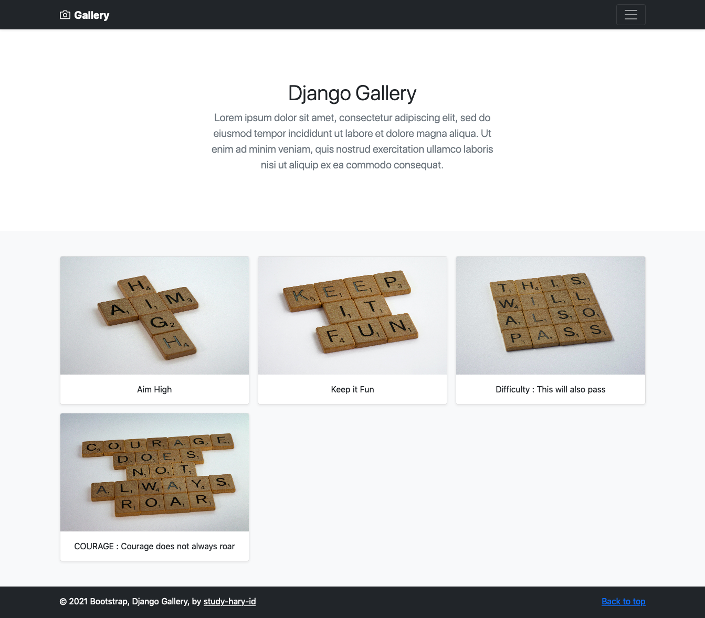

# Django Gallery Web Application

> The template source for this project is from [Bootstrap 5](https://getbootstrap.com/docs/5.0/examples/album/)

Based on this Udemy Certification [Create an Image Upload Web App with Python and Django](https://www.udemy.com/course/create-an-image-upload-web-app-with-python-and-django/).
May not be entirely the same, because they are many customizations.
All of this is still under development and adding more features.

## Installation

Django Gallery requires Python 3.8.x, Django 3.1.x, Pillow 8.2.x, Bootstrap 5 and OS specific dependency tools.

> The `main` branch is the development version and it may be unstable. To use the latest stable version, download it from the Releases page or switch to a release tag.

The step by step to run Django Gallery in local machine :
1. Make sure Python is installed with the correct version
2. You can use Python globally or use virtual environment
3. Use this command `pip install -r requirements.txt`
4. Run database migrations `python manage.py migrate`
5. Create super user to upload image to Django Gallery

    `python manage.py createsuperuser`

6. Run the development server for testing the app

    `python manage.py runserver`

7. Open this url `http://localhost:8000`
